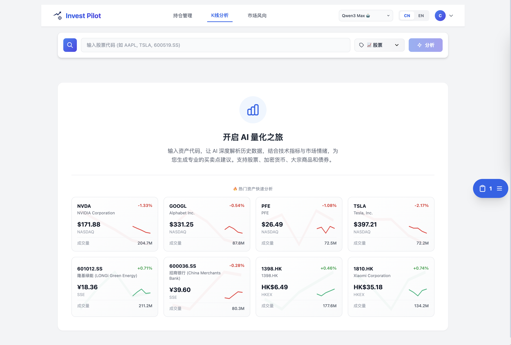

# InvestPilot 🚀

**AI-Powered Investment Copilot — 让 AI 帮你看盘、选股、管仓位。**


> ⚠️ **免责声明**：本项目仅供学习和研究，不构成任何投资建议。股市有风险，投资需谨慎。

---

## ✨ 亮点

🎯 **智能选股** — 联网搜索实时资讯，结合技术面多维筛选，给出带信心评级的推荐  
📈 **K 线分析** — AI 解读历史走势，自动标注买卖时机，支持一键交易回测  
💼 **持仓管理** — 多币种、多资产类型，实时盈亏追踪，AI 一键诊断  
🤖 **多模型支持** — Gemini / GPT / Claude / Qwen，自由切换，按需选择  

---

## 🖥️ 功能概览

| 功能 | 说明 |
|------|------|
| 📊 K 线趋势分析 | 深度解析价格数据，AI 标注买卖时机，历史交易回测 |
| 🎯 智能选股推荐 | 实时市场扫描 + 量化策略，支持按资金/风险/频率筛选 |
| 💼 虚拟持仓 | 管理股票、加密货币、黄金、现金，自动计算成本与盈亏 |
| 🔍 持仓诊断 | 基于真实持仓 AI 全面分析，无需手动输入 |
| 📡 联网搜索 | 支持 Gemini / Qwen / OpenAI 联网获取最新市场情报 |

---

<p align="left">
  
</p>

## 🚀 快速开始

### 本地运行

```bash
git clone git@github.com:chang1sun/InvestPilot.git
cd InvestPilot

python3 -m venv venv && source venv/bin/activate
pip install -r requirements.txt

cp env.example .env   # 编辑 .env，至少填入一个 AI API Key
python tools/init_db.py
python app.py
```

打开 `http://localhost:5000` 即可使用。

### Docker 部署

```bash
# 在 docker-compose.yml 中配置你的 API Key
docker-compose up -d
```

---

## ⚙️ 配置

在 `.env` 文件中配置（参考 `env.example`）：

```env
# AI API Keys（至少配置一个）
GEMINI_API_KEY=your_key        # Google Gemini
OPENAI_API_KEY=your_key        # OpenAI GPT
ANTHROPIC_API_KEY=your_key     # Anthropic Claude
QWEN_API_KEY=your_key          # 阿里通义千问（国内推荐）

# 可选
DATABASE_URL=sqlite:///investpilot.db   # 默认 SQLite
REDIS_URL=redis://localhost:6379/0      # 默认内存缓存
```

---

## 📄 License

[MIT](LICENSE)